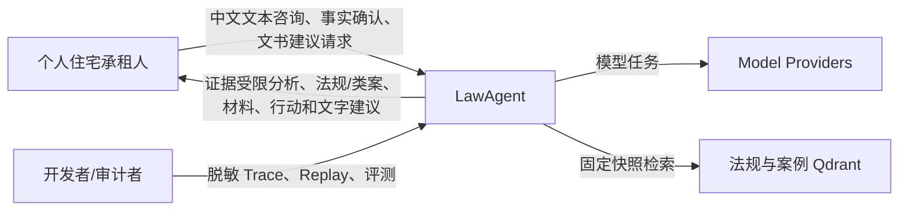
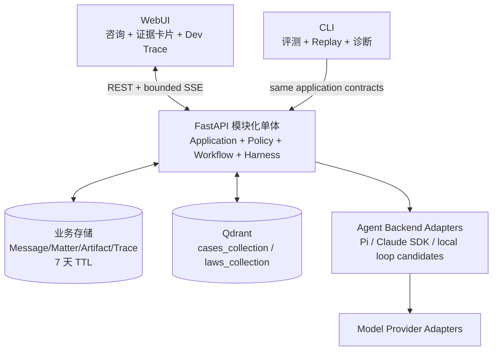
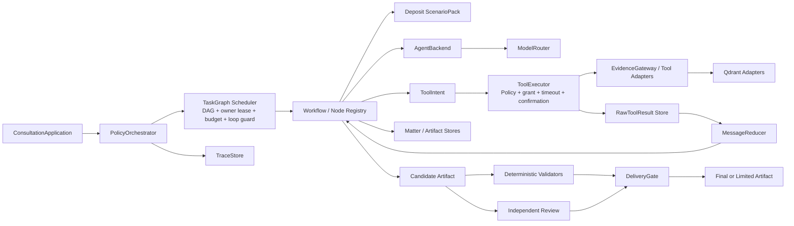

# LawAgent C4 Views
> 摘要：用 C1–C3 视图呈现住宅押金 MVP 的用户、应用、Runtime、模型、检索和存储关系。
> 摘要：WebUI/API 是真实产品入口；CLI 与 Trace Viewer 是开发入口；桌面端只保留未来消费者边界。
> 摘要：单机模块化单体承载 Policy、Workflow、ScenarioPack 与 Agent Harness，目标少量并发。
> 摘要：法规/案例来自固定快照 Qdrant；实时权威法规、文件上传、Redis 和消息总线不进入 MVP。
> 摘要：Model Provider 与 Agent Backend 分层，第三方 SDK 不掌握领域状态转换或交付权。
> 摘要：所有历史实现与基础设施状态仍待远程运行核验。

## C1 System Context



LawAgent 不替代律师或裁判，不对外发送文书，不实时保证法规有效性。

## C2 Containers



首版不预设 Redis、Kafka/NATS、对象存储、实时法规容器或独立 Worker。远程已有实现若不同，先核验并通过 ADR 决定迁移。

## C3 Modules



### 关键控制权

- `PolicyOrchestrator`：唯一全局转换权；
- `TaskGraph Scheduler`：DAG 校验、节点状态、owner 租约、预算、escalation、handoff 与循环中断；
- `ScenarioPack`：领域事实、问题、证据与行动规则；
- `AgentBackend`：受控局部语义执行；
- `ToolExecutor`：ToolIntent 唯一执行入口，负责权限、Schema、预算、超时、读写门禁和 Trace；
- `MessageReducer`：保留 raw provenance，向 Agent 提供有界、标注 lossy 的 ToolResultView；
- `DeliveryGate`：确定性检查 + Review 后的最终裁决。
- Worker/Agent 只向 Scheduler 返回结果或 Escalation，不得彼此横向转派。

## 代码依赖候选

```text
apps/web, apps/cli
  -> application
  -> domain, policy, contracts
adapters/model, adapters/agent, adapters/qdrant, adapters/storage
  -> contracts
```

这是目标依赖方向，不是未经核验的远程真实目录。

## 可见性与核验项

- Web/API/SSE、Runtime、Taskboard、Qdrant Adapter 和前端历史实现；
- DB/内存存储、TTL 与删除能力；
- Agent Backend 和 Model Provider 的真实可用性；
- Qdrant collection/Schema/count；
- 运行、测试、性能和并发基线。
